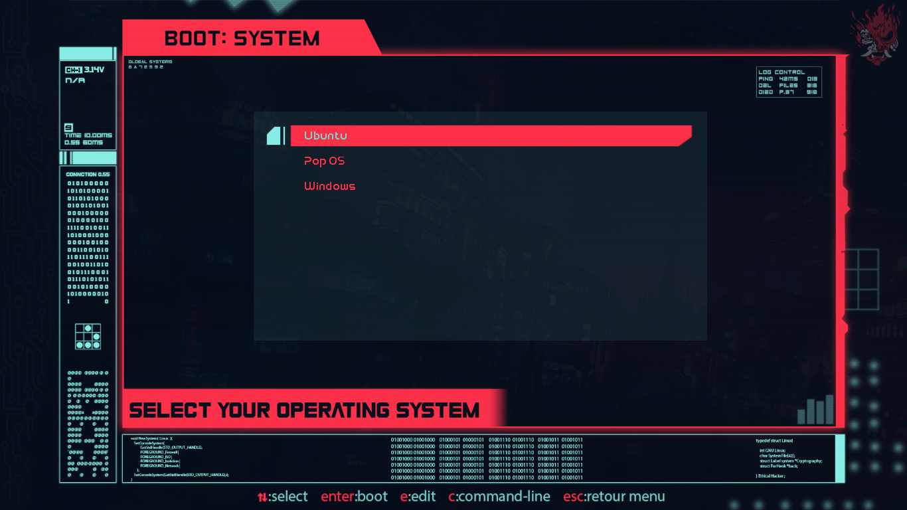

# Grub Theme Update


Welcome to the collection of Grub themes with previews of each one. Each theme can be installed and applied automatically via the provided script.

## Available Themes
Below are previews of the available themes:

- Aesthetic
- Anime
- CartoonGirl
- Cyberpunk
- CyberRe
- Elegant-Mountain
- fallout
- NeonPurple
- SekiroShadow
- Windows-Main
- Wuthering-changli

## Installation

Simply enter the following commands in your terminal:

```bash
git clone https://github.com/0xRad1ant/Grub-Themes.git
cd Grub-Themes
chmod +x install.sh
sudo ./install.sh
```

The script will prompt you to select a theme from the list, install it to your Grub directory, and configure Grub automatically.

### Previews
The previews of each theme are listed below. Click on each image to view it in full size.

## Aesthetic


## Anime


## CartoonGirl


## Cyberpunk


## CyberRe


## Elegant-Mountain


## fallout


## NeonPurple


## SekiroShadow


## Windows-Main


## Wuthering-changli

